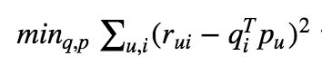
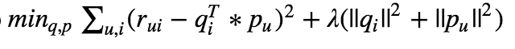

# Matrix Factorization Based Recommenders

You've built an item-item recommender, and now you'll use a matrix factorization approach for making
recommendations. Since performance is important for recommendation systems, we're going to use an existing library for
computing our matrix factorizations. This way, we can get started quickly, iterate quickly, and try lots of things.

First, make sure graph lab is installed on your machine.

```python
import graphlab
```

If it's not, install it by following the instructions here:

[https://dato.com/download/](https://dato.com/download/)

Once registered, you should be able to get running with only the `pip install ...` line that includes the license information (and not creating a new Python environment.)

# Creating a matrix factorization model

1. You'll need to store your data in Dato's SFrame type. `graphlab.SFrame(pandas_data)` will do the conversion. In general, an SFrame is like a Pandas DataFrame, but a little different, you can do similar things, but you may have to read the docs to figure out how. We can discard the `timestamp` column since we won't be using it here.

1. Create a matrix factorization model. Using the `graphlab.recommender.factorization_recommender.create` function. You should be able to train a minimal model by specifying just the `user_id`, `item_id` and `target` arguments. Set `solver='als'` to get the Alternating Least Squares solution.

1. Call the `predict` method on your input data to get the predicted rating for user 1 of movie 100.

    Note: You can use the following snippet of code to create an `SFrame` with just the single datapoint:

    ```python
    one_datapoint_sf = graphlab.SFrame({'user': [1], 'movie': [100]})
    ```

    Make note of this number since we're going to try to reproduce it.

1. Call the `list_fields` method to see what kind of data is stored for your model. Note, `coefficients` is one option.

1. Inspect the output of `.get('coefficients')` to see what information your model uses. Make sure your model isn't including any data beyond user, item and rating. If timestamp appears to be included, exclude it.

1. There should be a `movie` and a `user` array in the coefficients. The `factors` column contains the values in the movie and user matrices. What are the dimensions of these two matrices?

1. Without using the `predict` method, compute the predicted rating user 1 of movie 100.

    If you're not getting the same thing, don't forget to use the `intercept` term!

1. What is the intercept term? Can you reproduce the calculation of this value on your own?

1. Call the `predict` method on your input data to get the predicted ratings, and verify that the RMSE reported by the model diagnostics is correct.

    Look at the `list_fields` again to find the rmse.

1. Compare the summary statistics of the original data with your predictions. (`pd.Series(ratings).describe()` to do this). Does anything stand out about the min/max?

1. Use matplotlib to make a `violinplot` of the true ratings (x-axis) vs the predicted ratings (y-axis). Do any trends emerge?

    Look at the form of `data` in [this matplotlib example](http://matplotlib.org/examples/statistics/violinplot_demo.html) if you're having trouble figuring out how to use the violin plot.

1. Notice, that graphlab provides two regularization parameters. The parameter `regularization` controls the value of lambda and is essentially changing the target function from <br>
 <br>
to <br>
 <br>
Using what you know about regularization from linear regression, what effect would you expect this to have on solutions? What would you expect to see in the difference of training RMSE between setting this parameter to 0 or 1e-4? Try it.

## Extra Credit

#### Tuning Parameters

With tuning parameters how should we know what the best value for those parameters is? Easy, our old friend Cross-Validation. Dato has a similar cross-validation framework to sklearn called [model parameter search](https://dato.com/learn/userguide/model_parameter_search/introduction.html). With a few differences. One big difference is that it will work asynchronously, meaning that you'll get an object back and your python process will be unblocked before the job has finished! You can check the status of your job using `job.get_status()`. When it's done, use `job.get_results()`.

1. Tune your model to find the best parameters. What parameters are being tuned by this procedure?

#### What are the latent features?

1. Can you construct an intuitive explanation for what the latent features represent? Try comparing the correlation of the latent feature with the movie ratings (using scipy's cdist) then match the movie ids to titles and see what you can find. How might you use this information? Remember, the _user_ coefficients are the ones that describe a user's affinity for a type of movie, so you'll want to use those (conversely the movie features describe the kinds of users to which that movie appeals)!
